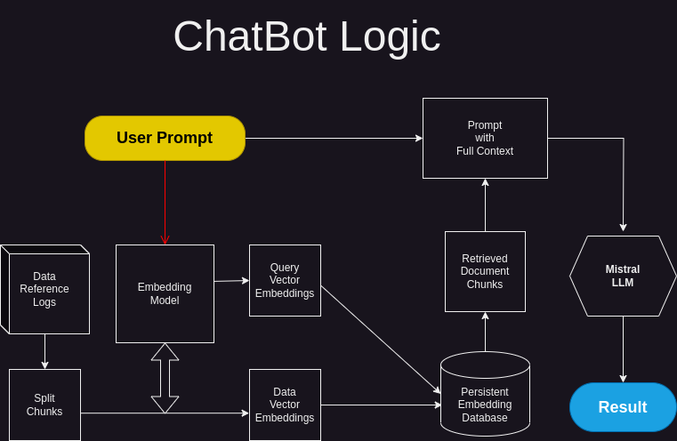

# ChatBot
Basic ChatBot using CTransformers, ChromaDB and Gradio
- See a live demo on HuggingFace at:
- https://huggingface.co/spaces/JDWebProgrammer/chatbot

- Copy text files into ./data/reference

# Description
This is a simple ChatBot to use as a simple starting template

# Dependencies
pip install -r requirements.txt

# Run
python app.py

# Interface
The web interface will start at http://0.0.0.0:7864

# Status / Updates
- Currently embeddings reset and reload each script start: Hard persistence is causing errors
- Chat history does not yet save properly! Working on this
- There is currently no feedback but plan to add implementation for it

# Credits
- Mistral: https://mistral.ai/
- HuggingFace: https://huggingface.co/
- TheBloke: https://huggingface.co/TheBloke
- ctransformers: https://github.com/marella/ctransformers
- gradio: https://github.com/gradio-app/gradio
- chroma: https://github.com/chroma-core/chroma

